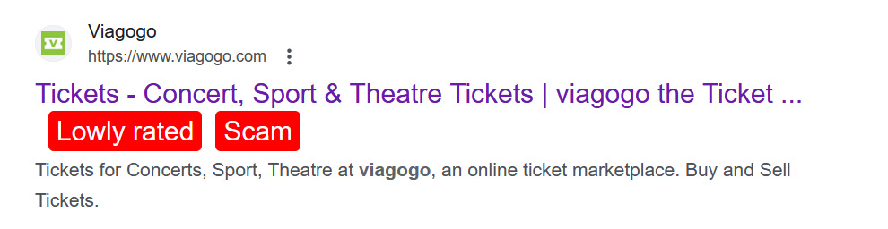

# WebRate - rate any website

Extension on Mozzila Add-ons: https://addons.mozilla.org/en-US/firefox/addon/webrate/
## About

Modern internet is broken. Whenever we visit a new webpage we are bombarded with notification pop-ups, cookie notices, ads, scams etc. Search engines promised to provide us with the most relevant content related to our query, but over time SEO became a game won by websites whose content was not created for people, but for algorithms. Often, even the content is algorithmically generated.

It's became increasingly harder to navigate in the sea of malicous content.

With *WebRate* browser extension, users can map poor websites and their malevolent practices. The websites' ratings are shown in Google search results, as shown in example below:

It's also possible to rate a high-quality content.

## Todos

* extension support for Chrome
* show ratings in DuckDuckGo, Bing, Yahoo, Brave Search

## Contributions

Anyone is welcome to contribute to this project.

## Notices

Icons in the extension found on <a href="https://www.svgrepo.com/collection/untitled-ui-oval-interface-icons" target="_blank">SVG Repo</a>.